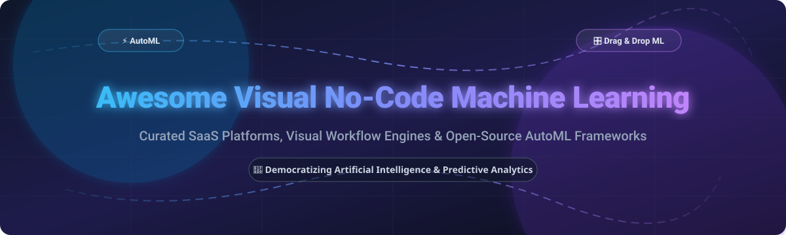

  

  

---

## 📌 Table of Contents

- [🧠 Overview & Ecosystem Summary](#-overview--ecosystem-summary)
- [🏢 Commercial SaaS & Cloud Platforms](#-commercial-saas--cloud-platforms)
- [🔓 Open-Source GitHub Projects](#-open-source-github-projects)
- [⚡ Key Features Comparison](#-key-features-comparison)
- [🤝 How to Contribute](#-how-to-contribute)
- [💖 Support & Sponsorship](#-support--sponsorship)
- [📈 Star History](#-star-history)
- [⚠️ Disclaimer & Best Practices](#-disclaimer--best-practices)

---

## 🧠 Overview & Ecosystem Summary

Visual No-Code Machine Learning (No-Code ML) and Automated Machine Learning (AutoML) enable software developers 💻, business analysts 📊, domain experts 🎯, and data scientists 🔬 to construct, evaluate, and deploy machine learning models without writing complex code. These tools range from enterprise drag-and-drop cloud suites (SageMaker Canvas, Vertex AI, Azure Designer) to flexible open-source libraries (Ludwig, AutoGluon, PyCaret, Orange).

---

## 🏢 Commercial SaaS & Cloud Platforms

**📊 Market Size & Industry Dynamics:**  
The global Automated Machine Learning (AutoML) & No-Code AI platform market size is estimated at **$6.8 Billion in 2024** and is projected to reach **$45.2 Billion by 2030**, growing at a Compound Annual Growth Rate (CAGR) of **37.1%**. The sector is currently **moderately fragmented**: hyper-scaler cloud infrastructure providers (Microsoft, AWS, Google) command core enterprise compute, while agile specialized vendors lead niche workflows such as GTM predictive agents, visual NLP, and edge computer vision. 📈

The following commercial platforms provide hosted infrastructure, automated model training, and governed deployment:

| 🚀 SaaS Product Platform | 🏢 Company Size / Valuation | 💰 Starting Price | 🎁 Free Tier / Free Trial Limits |
| :--- | :--- | :--- | :--- |
| **[Create ML](https://developer.apple.com/machine-learning/create-ml/)** Apple's native no-code ML builder for macOS/iOS. Enables visual model creation for image, video, sound, text, and tabular data on Mac hardware. | **$3.5 Trillion** Market Cap *(Apple)* | Free *(Included with Xcode on macOS)* | **Free forever** with full local training capabilities on macOS; app distribution requires Apple Developer Program ($99/year). |
| **[Azure Machine Learning Designer](https://azure.microsoft.com/en-us/products/machine-learning/)** Microsoft's visual drag-and-drop ML pipeline builder for enterprise workflows, dataset transformations, and model deployment on Azure. | **$3.0 Trillion** Market Cap *(Microsoft)* | $0.12/hour *(Standard DS2_v2 compute instance)* | **$200 free credit** for 30 days + 12 months of popular free Azure services. |
| **[Amazon SageMaker Canvas](https://aws.amazon.com/sagemaker/canvas/)** AWS no-code ML platform for tabular, time-series, vision, and NLP predictions with built-in foundation model support. | **$2.1 Trillion** Market Cap *(Amazon)* | $1.85/session-hour + $0.00005/cell analyzed | **2-month free trial** including 160 session-hours per month. |
| **[Google Vertex AI AutoML](https://cloud.google.com/vertex-ai)** Google Cloud AutoML service for tabular, image, video, and text data classification, regression, and object detection. | **$2.0 Trillion** Market Cap *(Alphabet / Google)* | $19.50/node-hour *(Vision training)*; $3.15/node-hour *(Tabular training)* | **$300 free credits** for 90 days across Google Cloud + free tier of up to 40 node-hours for AutoML. |
| **[DataRobot No-Code](https://www.datarobot.com/)** Enterprise AutoML & AI governance platform offering end-to-end visual model building, automated feature engineering, and deployment. | **$3.0 Billion** Valuation *(Peak $6.3B valuation)* | $10,000/year *(Enterprise Starter plan)* | **14-day free trial** with access to automated model building up to 10 project models. |
| **[Pecan AI](https://www.pecan.ai/)** Automated predictive AI platform designed for GTM teams, churn prediction, LTV modeling, and customer analytics without data science teams. | **$500 Million** Valuation *($117M total raised)* | $950/month *(Starter tier)* | **14-day free trial** with sample customer data integration and model building. |
| **[Akkio](https://www.akkio.com/)** No-code generative AI and predictive analytics platform for business analysts to turn spreadsheet data into real-time predictions. | **$50 Million** Valuation *($20M total raised)* | $49/month *(Starter plan)* | **14-day free trial** supporting unlimited datasets up to 100,000 rows. |
| **[Zams (formerly Obviously AI)](https://www.zams.ai/)** No-code AI agent and predictive modeling platform designed to turn raw business data into trained ML algorithms within minutes. | **$25 Million** Valuation *($10M total raised)* | $1,250/month *(Standard plan)* | **7-day free trial** with 1 active model build and sample dataset connections. |
| **[MonkeyLearn](https://monkeylearn.com/)** No-code text analysis and NLP platform for sentiment classification, keyword extraction, and customer feedback analysis. | **$15 Million** Valuation *(Acquired by Medallia)* | $299/month *(Team plan)* | **Free forever plan** with up to 300 queries/month; 14-day trial for Team tier. |
| **[MakeML](https://makeml.app/)** No-code computer vision tool for training object detection and semantic segmentation neural network models. | **$5 Million** Valuation *(Bootstrapped / Seed)* | $29.99/month *(Pro plan)* | **Free forever plan** supporting 1 active project and dataset limits up to 100 images. |

---

## 🔓 Open-Source GitHub Projects

The open-source ecosystem provides powerful self-hosted AutoML libraries, declarative low-code frameworks, and interactive visual pipeline software. Repositories below are sorted by GitHub Star Count (descending): ⭐

- **[ludwig](https://github.com/ludwig-ai/ludwig)**   
  📦 Declarative low-code framework for building custom LLMs, neural networks, and ML models via YAML configuration files.

- **[autogluon](https://github.com/autogluon/autogluon)**   
  ⚡ AWS open-source AutoML toolkit for automated deep learning on tabular, image, text, and time-series data with minimal code.

- **[tpot](https://github.com/EpistasisLab/tpot)**   
  🧬 Automated Machine Learning tool in Python that optimizes ML pipelines using genetic programming.

- **[pycaret](https://github.com/pycaret/pycaret)**   
  🪄 Open-source, low-code machine learning library in Python that automates model training, tuning, evaluation, and deployment.

- **[autokeras](https://github.com/keras-team/autokeras)**   
  🧠 AutoML library based on Keras for automated deep learning search across vision, text, and tabular domains.

- **[featuretools](https://github.com/alteryx/featuretools)**   
  🛠️ Open-source python library for automated feature engineering from relational and transactional datasets.

- **[h2o-3](https://github.com/h2oai/h2o-3)**   
  💧 Open-source, distributed, fast, and scalable machine learning platform featuring automated machine learning (H2O AutoML).

- **[orange3](https://github.com/biolab/orange3)**   
  🍊 Interactive component-based visual programming GUI software for data mining, data visualization, and machine learning.

- **[mljar-supervised](https://github.com/mljar/mljar-supervised)**   
  📝 Python package for AutoML on tabular data featuring automated feature engineering, hyperparameter tuning, explainability, and markdown report generation.

- **[MLBox](https://github.com/AxeldeRomblay/MLBox)**   
  🧰 Powerful automated machine learning python library for data preprocessing, feature selection, and hyperparameter optimization.

- **[LightAutoML](https://github.com/sberbank-ai-lab/LightAutoML)**   
  💡 Lightweight framework for automatic model creation, tabular AutoML, and end-to-end pipeline optimization.

- **[evalml](https://github.com/alteryx/evalml)**   
  📈 Domain-agnostic AutoML library written in Python for automated model construction, validation, and domain-specific evaluation.

- **[Auto_ViML](https://github.com/AutoViML/Auto_ViML)**   
  🔮 Automatically build multiple machine learning models with a single line of code, including automatic feature selection and visualization.

- **[rapidminer-studio](https://github.com/rapidminer/rapidminer-studio)**   
  ⚙️ Visual workflow engine for drag-and-drop machine learning, predictive modeling, and data science pipeline design.

- **[Sklearn-genetic-opt](https://github.com/rodrigo-arenas/Sklearn-genetic-opt)**   
  🧬 Hyperparameter optimization using genetic algorithms for Scikit-Learn machine learning estimators.

- **[zero2neuro](https://github.com/Symbiotic-Computing-Laboratory/zero2neuro)**   
  🖥️ Open-source zero-code graphical user interface (GUI) toolbox for constructing, training, and evaluating deep neural networks (DNNs, CNNs, U-Nets).

- **[SwiftPredict-v2](https://pypi.org/project/swiftpredict-v2/)**  
  🚀 Lightweight open-source AutoML framework with a FastAPI backend, Python SDK, and standalone local web UI for experiment tracking and model building.

---

## ⚡ Key Features Comparison

| 🎯 Target Domain | 🏢 Best Commercial SaaS Option | 🔓 Best Open-Source Option |
| :--- | :--- | :--- |
| **Tabular Classification & Regression** | Amazon SageMaker Canvas / DataRobot | AutoGluon / PyCaret |
| **Visual Workflow & Drag-and-Drop** | Azure Machine Learning Designer | Orange3 / RapidMiner Studio |
| **Deep Learning & Computer Vision** | MakeML / Google Vertex AI AutoML | Ludwig / AutoKeras / Zero2Neuro |
| **NLP & Text Analysis** | MonkeyLearn / SageMaker Canvas | Ludwig / AutoGluon |
| **Automated Feature Engineering** | DataRobot / Akkio | Featuretools / MLJAR |

---

## 🤝 How to Contribute

Contributions are warmly welcomed to keep this repository up-to-date and comprehensive! 🎉

1. **Fork** 🍴 the repository on GitHub.
2. Add or update entries in `README.md` following the established formatting guidelines.
3. Ensure open-source additions include valid GitHub repositories with star count badges linked to stargazers pages.
4. Submit a **Pull Request (PR)** 📥 with a clear title and description.

---

## 💖 Support & Sponsorship

If you find this repository helpful for your machine learning workflows, research, or projects, please consider:
- 🌟 **Starring** this repository on GitHub to increase visibility
- 🔀 **Forking** it to add your own additions or contributions
- 📢 **Sharing** it with your network, team, and data science community

Thank you for supporting open-source AI democratization! 🚀

---

## 📈 Star History

---

## ⚠️ Disclaimer & Best Practices

- **Community-Curated List:** This repository is community-maintained and provided for educational and research purposes.
- **Data Privacy & Security:** Cloud-hosted SaaS platforms may collect telemetry or training logs. Review data governance policies before uploading sensitive operational data. 🔒
- **Model Interpretability & Evaluation:** Always validate automated hyperparameter selection and evaluate model drift before deploying AutoML models into production environments. 🧪

---

  <b>Made with ❤️ for data scientists, developers, domain analysts, and organizations accelerating AI adoption.</b>

